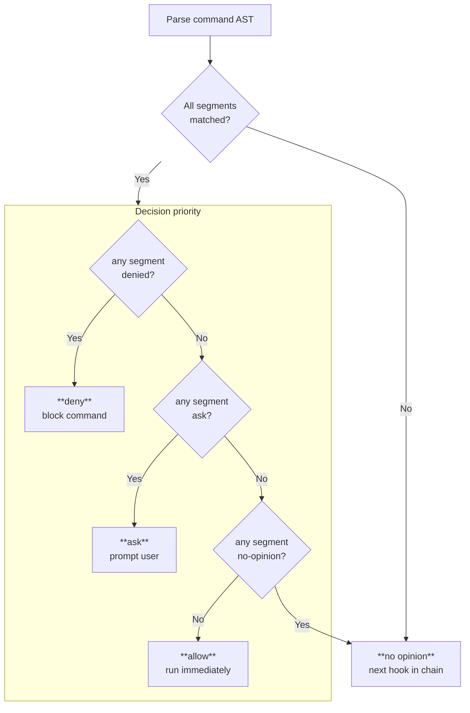

# claude-bash-approve

A Claude Code [PreToolUse hook](https://code.claude.com/docs/en/hooks) that auto-approves safe Bash commands, repo-scoped `Read`/`Grep` calls, and blocks dangerous operations. Written in Go for fast startup.

## Install

In Claude Code:

```
/plugin install github:mariusvniekerk/claude-bash-approve
```

That's it. The hook registers automatically and the Go binary compiles on first use. Requires Go 1.25+.

## How it works

When Claude Code is about to run a matched tool call, this hook intercepts it and makes one of four decisions:

- **deny** — command is blocked (with a reason shown to Claude)
- **ask** — recognized command, user is prompted to confirm (terminal — no further hooks run) (e.g. `git tag`)
- **no opinion** — hook has nothing to say, exits silently so the next hook in the chain can handle it (e.g. `git push`, `gh pr create`, or unrecognized commands)
- **allow** — command runs immediately, no prompt



Commands are parsed into an AST (using [mvdan/sh](https://github.com/mvdan/sh)) so chained commands (`&&`, `||`, `;`, `|`), subshells, command substitutions (`$(…)`), and control flow (`if`, `for`, `while`) are all handled correctly — every segment must be safe for the whole command to be approved.

For `Read` and `Grep`, the hook auto-approves only when the referenced paths stay inside the current Git repo or linked worktree root derived from the incoming `cwd`. Anything outside that boundary falls back to no-opinion.

### Wrappers + Commands

The hook uses a compositional model: a command is split into **wrappers** (prefixes like `timeout 30`, `env`, `VAR=val`) and a **core command** (like `git status`, `pytest`). Both are matched against regex patterns organized into categories.

## Alternative installation

### install.sh

```bash
git clone https://github.com/mariusvniekerk/claude-bash-approve.git
cd claude-bash-approve
./install.sh
```

Copies the hook source bundle into `~/.claude/hooks/bash-approve/`, builds the binary there, creates `~/.claude/settings.json` if needed, and adds the hook. Pass `--force` to merge into an existing settings file (requires `jq`).

### Manual setup

1. Clone this repo:

```bash
git clone https://github.com/mariusvniekerk/claude-bash-approve.git
```

2. Add the hook to your Claude Code settings (`~/.claude/settings.json`):

```json
{
  "hooks": {
    "PreToolUse": [
      {
        "matcher": "Bash",
        "hooks": [
          {
            "type": "command",
            "command": "~/.claude/hooks/bash-approve/run-hook.sh"
          }
        ]
      },
      {
        "matcher": "Read|Grep",
        "hooks": [
          {
            "type": "command",
            "command": "~/.claude/hooks/bash-approve/run-hook.sh"
          }
        ]
      }
    ]
  }
}
```

3. Copy the runtime hook bundle into `~/.claude/hooks/bash-approve/`:

```bash
mkdir -p ~/.claude/hooks/bash-approve
cp hooks/bash-approve/*.go ~/.claude/hooks/bash-approve/
cp hooks/bash-approve/go.mod hooks/bash-approve/go.sum ~/.claude/hooks/bash-approve/
cp hooks/bash-approve/categories.yaml hooks/bash-approve/run-hook.sh ~/.claude/hooks/bash-approve/
chmod +x ~/.claude/hooks/bash-approve/run-hook.sh
```

4. The hook auto-compiles on first run. The `run-hook.sh` shim rebuilds the Go binary whenever source files change, so there's no manual build step.

## Configuration

Command categories are configured in `hooks/bash-approve/categories.yaml` for Bash command matching. When this file is absent or empty, all matched Bash commands are approved (with some exceptions noted below). `Read` and `Grep` are governed by repo/worktree path checks instead.

### Enabled / Disabled

```yaml
# Approve everything except git push
enabled:
  - all
disabled:
  - git push
```

```yaml
# Only approve git and shell commands
enabled:
  - git
  - shell
```

`disabled` always overrides `enabled` — use it to carve out exceptions.

### Default decisions by command

Most matched commands are auto-approved. Some have different defaults:

| Decision | Commands |
|----------|----------|
| **deny** (blocked, reason shown to Claude) | `git stash`, `git revert`, `git reset --hard`, `git checkout .`, `git clean -f`, `rm -r`, `go mod vendor`, `roborev tui` |
| **ask** (terminal, user prompted) | `git tag` |
| **no-opinion** (deferred to next hook) | `git push`, `jj git push`, `gh pr create`, `go mod init` |

To override a default, add the specific command name to `enabled` or `disabled`.

### Available categories

**Coarse groups** (enable/disable entire ecosystems):

`wrapper`, `git`, `jj`, `python`, `node`, `rust`, `make`, `shell`, `gh`, `go`, `kubectl`, `gcloud`, `bq`, `aws`, `acli`, `roborev`, `docker`, `ruby`, `brew`, `shellcheck`, `grpcurl`

**Fine-grained names** (within each group):

| Group | Names |
|-------|-------|
| wrapper | `timeout`, `nice`, `env`, `env vars`, `.venv`, `bundle exec`, `rtk proxy`, `command`, `node_modules/.bin`, `absolute path` |
| git | `git read op`, `git write op`, `git push`, `git tag`, `git destructive` (`git stash`, `git revert`, `git reset --hard`, `git checkout .`, `git clean -f`) |
| jj | `jj read op`, `jj write op`, `jj git push` |
| python | `pytest`, `python`, `ruff`, `uv`, `uvx` |
| node | `npm`, `npx`, `node -e`, `bun`, `bunx`, `vitest` |
| rust | `cargo`, `maturin` |
| shell | `read-only`, `touch`, `mkdir`, `cp -n`, `ln -s`, `shell builtin`, `shell vars`, `process mgmt`, `eval`, `echo`, `cd`, `source`, `sleep`, `var assignment`, `shell destructive` (`rm -r`) |
| go | `go`, `go mod vendor`, `go mod init`, `golangci-lint`, `ginkgo` |
| gh | `gh read op`, `gh pr create`, `gh write op`, `gh api` |
| kubectl | `kubectl read op`, `kubectl write op`, `kubectl port-forward`, `kubectl exec`, `kubectl cp` |
| docker | `docker`, `docker compose`, `docker-compose` |
| ruby | `rspec`, `rake`, `ruby`, `rails`, `bundle`, `gem`, `rubocop`, `solargraph`, `standardrb` |

See `categories.yaml` for the full reference with examples.

## Telemetry

Every decision is logged to a local SQLite database (`telemetry.db`, next to the binary). With the install script deployment model, this lives at `~/.claude/hooks/bash-approve/telemetry.db`. This lets you review what the hook approved, denied, or passed through:

```bash
sqlite3 ~/.claude/hooks/bash-approve/telemetry.db "SELECT ts, decision, command, reason FROM decisions ORDER BY ts DESC LIMIT 20"
```

Telemetry is best-effort — if the database can't be opened or written to, the hook continues normally.

## Debugging

Test the hook directly by piping JSON to stdin:

```bash
echo '{"tool_name":"Bash","tool_input":{"command":"git status"}}' | \
  go run ./hooks/bash-approve/
```

Output is a JSON object with the decision:

```json
{"hookSpecificOutput":{"hookEventName":"PreToolUse","permissionDecision":"allow","permissionDecisionReason":"git read op"}}
```

No output (exit 0) means the hook has no opinion.

## Running tests

```bash
cd hooks/bash-approve
go test -v ./...
```

## Discovering new patterns

The project includes a Claude Code skill (`.claude/skills/bash-approve-telemetry/`) that queries the telemetry database to find commands that need new rules. Ask Claude to "check the telemetry for approval candidates" or invoke `/bash-approve-telemetry`.

## Adding new commands

1. Add a `NewPattern(...)` entry to `allCommandPatterns` or `allWrapperPatterns` in `hooks/bash-approve/rules.go`
2. Choose the right decision:
   - `allow` (default) — auto-approve
   - `WithDecision("deny")` + `WithDenyReason("...")` — block with reason
   - `WithDecision("ask")` — terminal prompt to user
   - `WithDecision("")` — no opinion, defer to next hook
3. Add test cases in `main_test.go`
4. Update the category listing in `categories.yaml` if introducing a new group
4. Run `go test ./...`
