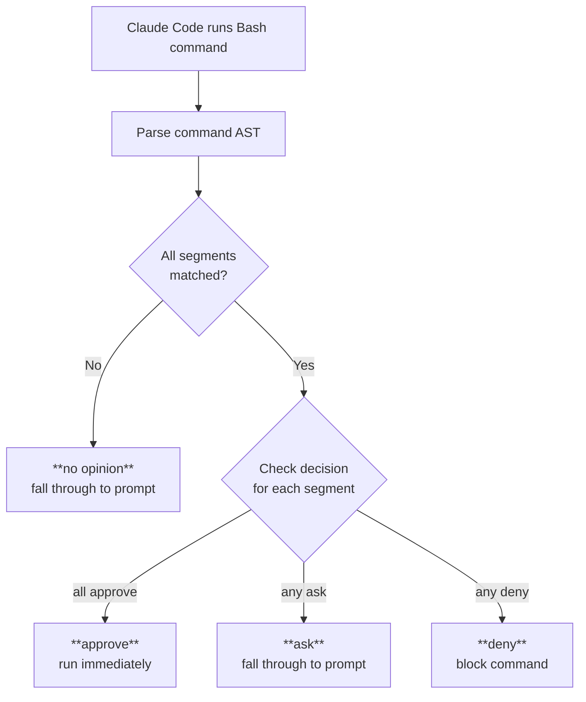

# claude-bash-approve

A Claude Code [PreToolUse hook](https://docs.anthropic.com/en/docs/claude-code/hooks) that auto-approves safe Bash commands and blocks dangerous ones. Written in Go for fast startup.

## How it works

When Claude Code is about to run a Bash command, this hook intercepts it and makes one of three decisions:

- **approve** — command runs immediately, no prompt
- **ask** — recognized command, but explicitly falls through to Claude Code's permission prompt (e.g. `git push`, `gh pr create`)
- **deny** — command is blocked
- **no opinion** — unrecognized command, falls through to Claude Code's normal permission prompt



Commands are parsed into an AST (using [mvdan/sh](https://github.com/mvdan/sh)) so chained commands (`&&`, `||`, `;`, `|`), subshells, command substitutions (`$(…)`), and control flow (`if`, `for`, `while`) are all handled correctly — every segment must be safe for the whole command to be approved.

### Wrappers + Commands

The hook uses a compositional model: a command is split into **wrappers** (prefixes like `timeout 30`, `env`, `VAR=val`) and a **core command** (like `git status`, `pytest`). Both are matched against regex patterns organized into categories.

## Installation

### Prerequisites

- Go 1.25+
- Claude Code

### Quick install

```bash
git clone https://github.com/mariusvniekerk/claude-bash-approve.git
cd claude-bash-approve
./install.sh
```

This builds the binary, creates `~/.claude/settings.json` if it doesn't exist, and adds the hook. If `settings.json` already exists, it prints the config snippet to add manually — or pass `--force` to merge it in (requires `jq`; backs up the original first).

### Manual setup

1. Clone this repo (or copy the `hooks/bash-approve` directory):

```bash
git clone https://github.com/mariusvniekerk/claude-bash-approve.git
```

2. Add the hook to your Claude Code settings (`~/.claude/settings.json`):

```json
{
  "hooks": {
    "PreToolUse": [
      {
        "matcher": "Bash",
        "hooks": [
          {
            "type": "command",
            "command": "/path/to/claude-bash-approve/hooks/bash-approve/run-hook.sh"
          }
        ]
      }
    ]
  }
}
```

Replace `/path/to/` with the actual path to your clone.

3. The hook auto-compiles on first run. The `run-hook.sh` shim rebuilds the Go binary whenever source files change, so there's no manual build step.

## Configuration

Command categories are configured in `hooks/bash-approve/categories.yaml`. When this file is absent or empty, all commands are approved (with some exceptions noted below).

### Enabled / Disabled

```yaml
# Approve everything except git push
enabled:
  - all
disabled:
  - git push
```

```yaml
# Only approve git and shell commands
enabled:
  - git
  - shell
```

`disabled` always overrides `enabled` — use it to carve out exceptions.

### Default decisions by command

Most matched commands are auto-approved. Some have different defaults:

| Decision | Commands |
|----------|----------|
| **ask** (fall through to prompt) | `git push`, `jj git push`, `gh pr create`, `go mod init` |
| **deny** (blocked) | `go mod vendor`, `roborev tui` |

To override a default, add the specific command name to `enabled` or `disabled`.

### Available categories

**Coarse groups** (enable/disable entire ecosystems):

`wrapper`, `git`, `jj`, `python`, `node`, `rust`, `make`, `shell`, `gh`, `go`, `gcloud`, `bq`, `aws`, `acli`, `roborev`, `docker`, `ruby`, `brew`

**Fine-grained names** (within each group):

| Group | Names |
|-------|-------|
| wrapper | `timeout`, `nice`, `env`, `env vars`, `.venv`, `bundle exec`, `rtk proxy`, `command`, `absolute path` |
| git | `git read op`, `git write op`, `git push` |
| jj | `jj read op`, `jj write op`, `jj git push` |
| python | `pytest`, `python`, `ruff`, `uv`, `uvx` |
| node | `npm`, `npx`, `node -e`, `bun`, `bunx` |
| rust | `cargo`, `maturin` |
| shell | `read-only`, `touch`, `mkdir`, `cp -n`, `ln -s`, `shell builtin`, `shell vars`, `process mgmt`, `eval`, `echo`, `cd`, `source`, `sleep`, `var assignment` |
| go | `go`, `go mod vendor`, `go mod init`, `golangci-lint`, `ginkgo` |
| gh | `gh read op`, `gh pr create`, `gh write op`, `gh api` |
| docker | `docker`, `docker compose`, `docker-compose` |
| ruby | `rspec`, `rake`, `ruby`, `rails`, `bundle`, `gem`, `rubocop`, `solargraph`, `standardrb` |

See `categories.yaml` for the full reference with examples.

## Telemetry

Every decision is logged to a local SQLite database (`telemetry.db`, next to the binary). This lets you review what the hook approved, denied, or passed through:

```bash
sqlite3 hooks/bash-approve/telemetry.db "SELECT ts, decision, command, reason FROM decisions ORDER BY ts DESC LIMIT 20"
```

Telemetry is best-effort — if the database can't be opened or written to, the hook continues normally.

## Debugging

Test the hook directly by piping JSON to stdin:

```bash
echo '{"tool_name":"Bash","tool_input":{"command":"git status"}}' | \
  go run ./hooks/bash-approve/
```

Output is a JSON object with the decision:

```json
{"hookSpecificOutput":{"hookEventName":"PreToolUse","permissionDecision":"allow","permissionDecisionReason":"git read op"}}
```

No output (exit 0) means the hook has no opinion.

## Running tests

```bash
cd hooks/bash-approve
go test -v ./...
```

## Adding new commands

1. Add a `NewPattern(...)` entry to `allCommandPatterns` or `allWrapperPatterns` in `hooks/bash-approve/rules.go`
2. Add test cases in `main_test.go`
3. Update the category listing in `categories.yaml` if introducing a new group
4. Run `go test ./...`
